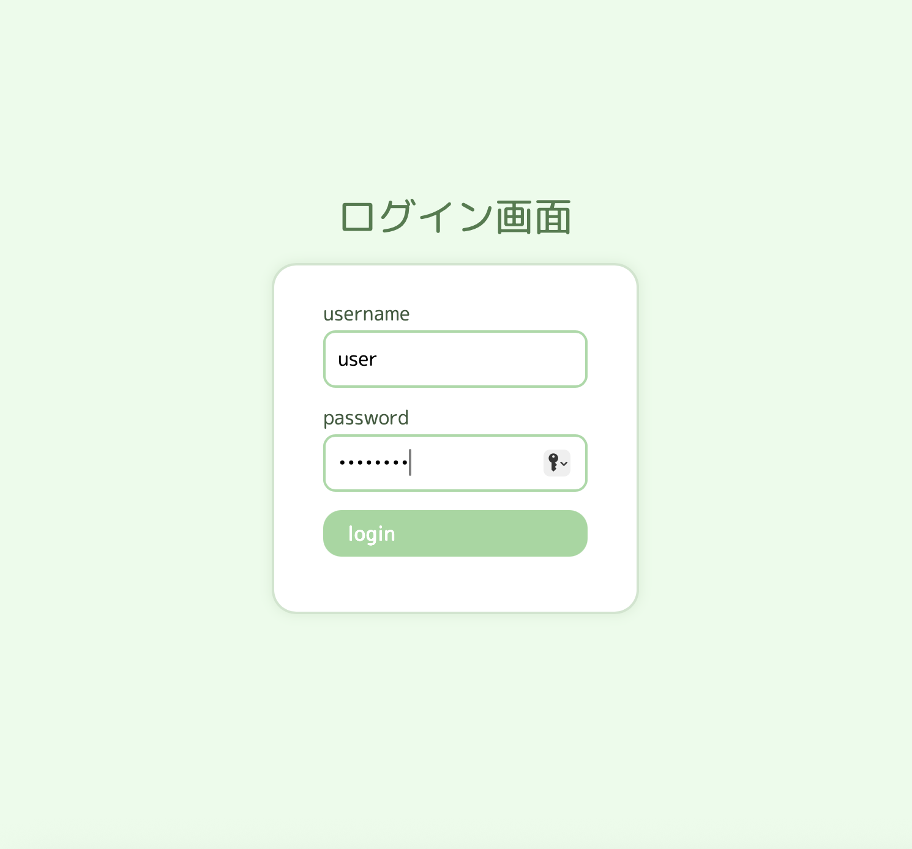
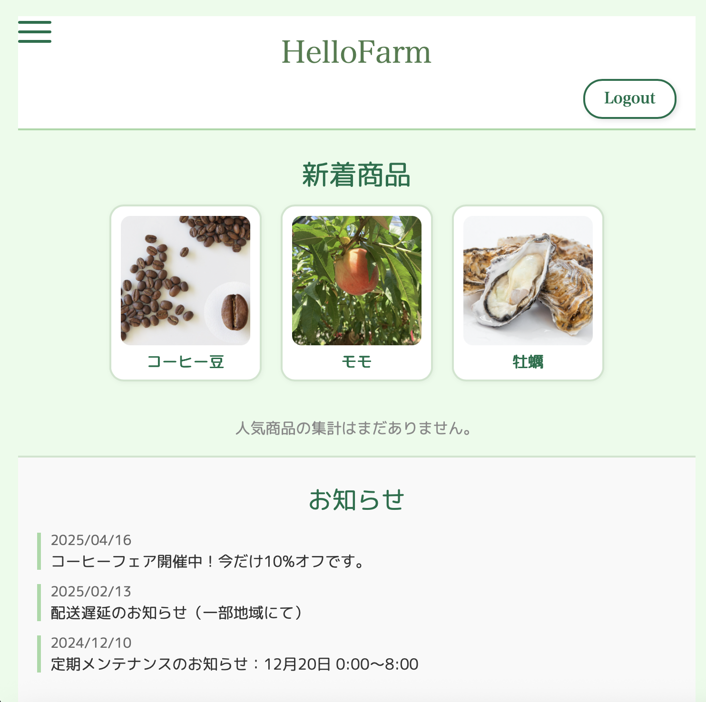
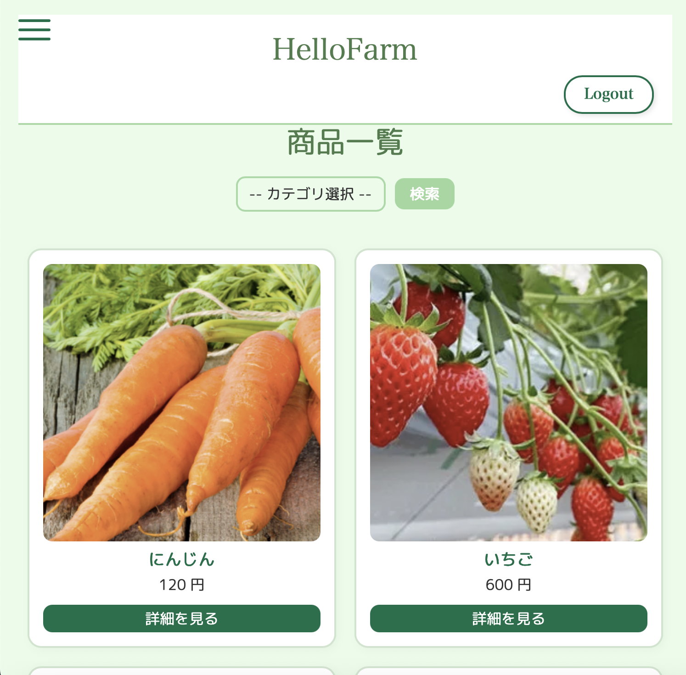
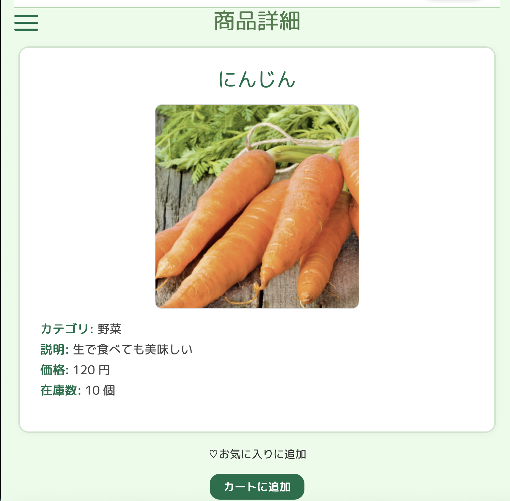
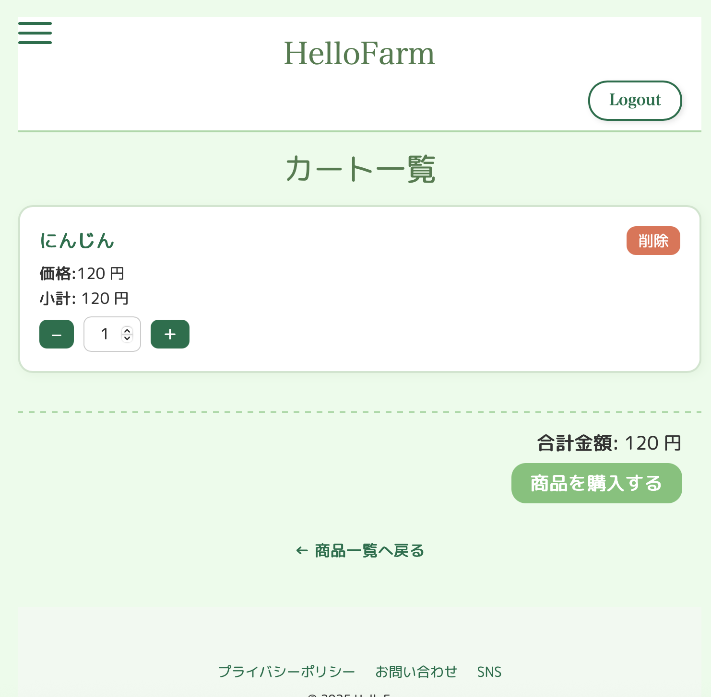
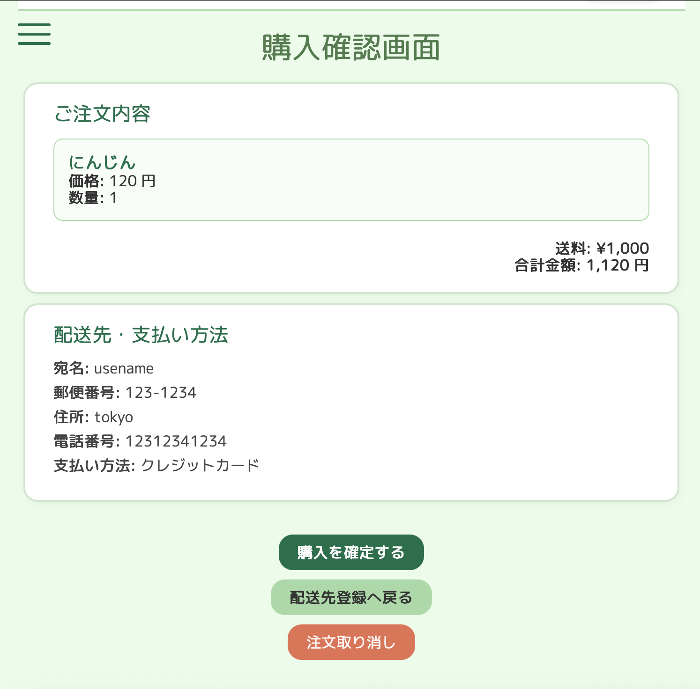
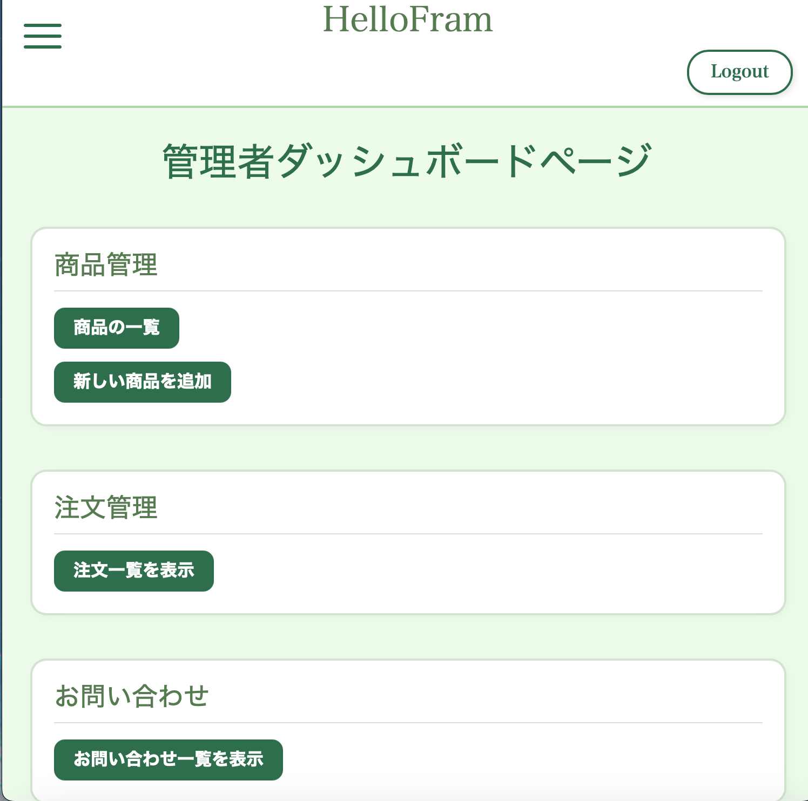

# 農業ECサイト（Portfolio Project）
## 概要
農家さんと消費者をつなぐオンラインショップのECサイトです。  
ユーザーは商品をカートに追加して購入でき、管理者は商品や注文を管理できます。
## 主な機能
- ユーザー / ログイン機能
- 商品一覧 / 商品詳細ページ
- カートに追加 / カートから削除
- 注文機能（購入処理）
- 管理者画面（商品登録・編集・注文管理）
## 使用技術
- Java 21
- Spring Boot 3.4
- MyBatis
- PostgreSQL
- Thymeleaf
- HTML/CSS/javascript(簡単なフロントエンド)
## スクリーンショット
##ログインページ

##トップページ(user)

##商品一覧

##商品詳細ページ

##カートページ

##注文確認ページ

##トップページ(管理者)

## 工夫したポイント
- Spring Securityを使ってログイン・認証を実装
- カート機能では在庫管理も行う
- 管理者用とユーザー用で画面を分けた
